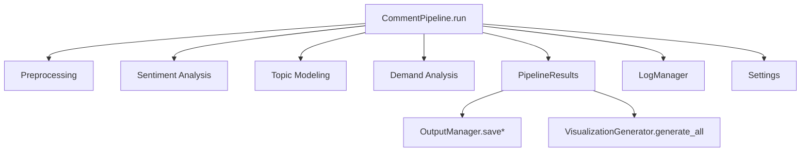
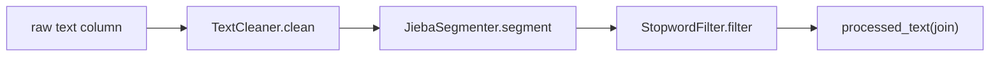
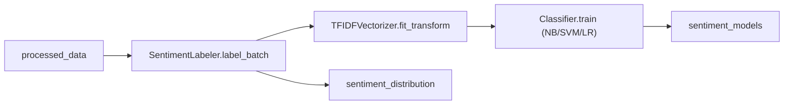
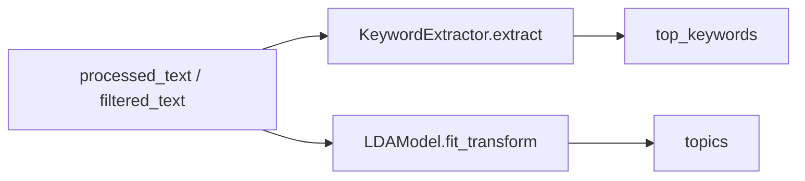
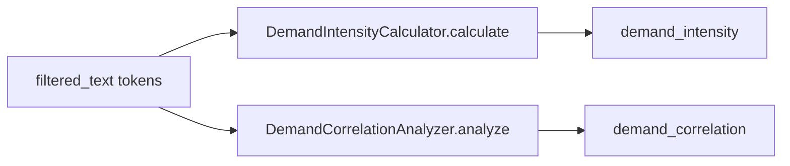
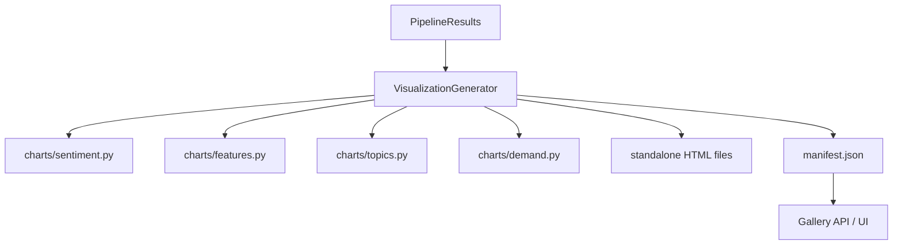

# 模块关联与执行流程

## 1. 总体调用关系

---

## 2. 预处理阶段

产物列：

- `cleaned_text`
- `segmented_text`
- `filtered_text`
- `processed_text`

---

## 3. 情感阶段

---

## 4. 主题阶段

---

## 5. 需求阶段

---

## 6. 可视化链路

---

## 7. 数据流与控制流要点

- 控制流是串行的（Preprocessing → Sentiment → Topic → Demand），便于调试和结果可解释。
- 数据流集中在 `DataFrame` 增量列上，减少模块间对象转换成本。
- `PipelineResults` 是统一输出协议，隔离“分析阶段”和“持久化/可视化阶段”。
- 配置与日志是横切关注点：`Settings` 和 `LogManager` 覆盖所有阶段。

